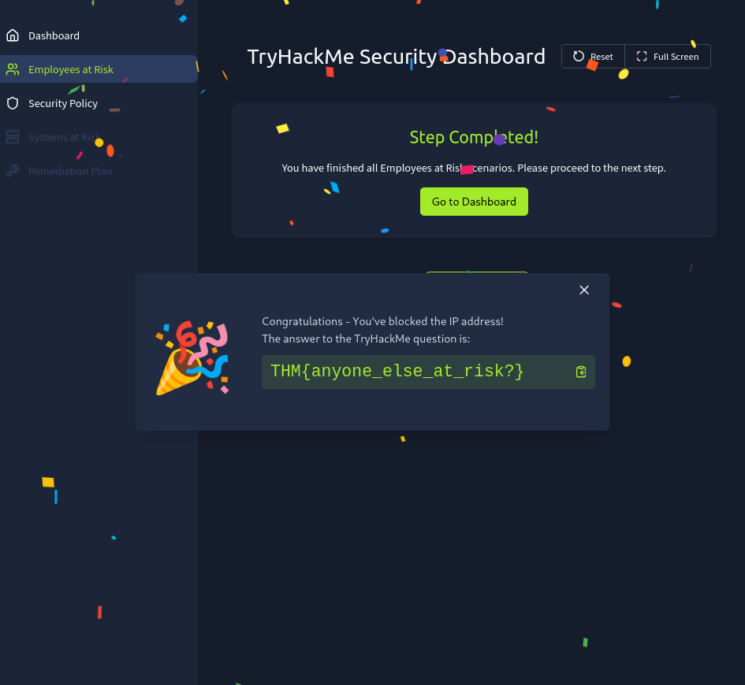
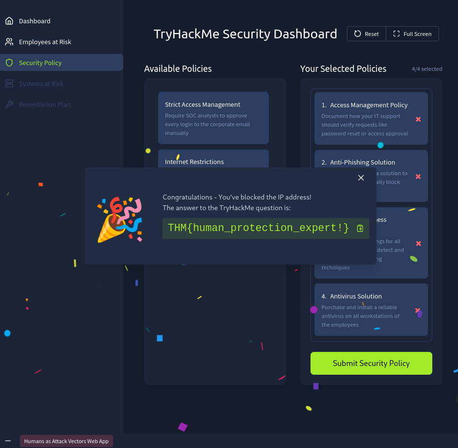

# Humans Attack Vectors — SOC Perspective 🛡️

> Exploring how attackers manipulate the weakest link in cybersecurity — humans — and how SOC analysts defend against these threats through detection, mitigation, and awareness.

---

# Room Information

| Category   | Details                                            |
| ---------- | -------------------------------------------------- |
| Platform   | TryHackMe                                          |
| Room       | Humans Attack Vectors                              |
| Difficulty | Easy                                               |
| Focus Area | Social Engineering, Human Security, SOC Operations |

---

# Lab Link

🔗 [https://tryhackme.com/room/humansattackvectors/](https://tryhackme.com/room/humansattackvectors/)

---

# Introduction

Modern cyberattacks are no longer focused only on firewalls, servers, or software vulnerabilities. In many cases, attackers target something far easier — people.

Humans often become the weakest security layer because emotions like fear, urgency, trust, and curiosity can be manipulated much faster than hardened infrastructure. This room focuses on how attackers exploit human psychology using social engineering techniques and how SOC analysts help organizations detect and mitigate these threats.

Throughout this lab, we explored multiple attack vectors including phishing, impersonation, malware delivery, fake support scams, and deepfake-based attacks while understanding the defensive role of a SOC team.

---

# Task 1 — Introduction

The room introduces the concept of human-centric cyberattacks and explains why modern SOC teams must monitor not only systems but also user behavior and suspicious interactions.

## Key Learning Objectives

* Understanding the human element in cybersecurity
* Learning common social engineering attack techniques
* Exploring the role of SOC analysts in detection and mitigation
* Practicing defensive actions in realistic scenarios

---

# Task 2 — The Human Element

Attackers often prefer targeting humans instead of directly attacking hardened infrastructure because people can unknowingly provide access themselves.

Rather than spending days exploiting systems, an attacker may simply trick an employee into opening a malicious attachment or entering credentials into a fake login page.

## Why Humans Are Targeted

Humans provide attackers with:

* Email access
* VPN access
* Corporate credentials
* Database access
* Banking sessions
* Internal network footholds

This makes social engineering extremely effective in real-world attacks.

---

# Common Examples

| Attack                   | Goal                    |
| ------------------------ | ----------------------- |
| HR mailbox compromise    | Employee data theft     |
| Fake banking login       | Financial theft         |
| VPN credential phishing  | Internal network access |
| Government impersonation | Intelligence gathering  |

---

# Answers

## Question 1

### What or who is the weakest link in cyber security?

```text
Humans
```

---

## Question 2

### What do attackers seek when targeting humans in a cyberattack?

```text
Access
```

---

# Task 3 — Attacks on Humans

This section focuses on social engineering techniques used by threat actors.

Social engineering works because attackers create situations that appear:

* Legitimate
* Urgent
* Emotional
* Trustworthy

Instead of bypassing technical defenses directly, attackers manipulate users into helping them.

---

# Phishing Attacks 🎣

Phishing remains one of the most common attack vectors.

Attackers typically use:

* Fake sender emails
* Fake login pages
* Malicious attachments
* Credential harvesting websites

The goal is usually to steal credentials or deploy malware.

---

# Malware Delivery

Threat actors commonly distribute malware through:

* Fake software update pages
* Fake CAPTCHA verification prompts
* QR-code based redirections
* Trojanized downloads

Many modern malware campaigns use information stealers capable of extracting:

* Browser credentials
* Session cookies
* Crypto wallets
* Saved passwords

---

# Deepfake Threats 🤖

AI-generated deepfake audio and video attacks are becoming increasingly dangerous.

Attackers can impersonate:

* CEOs
* Managers
* Family members
* IT teams

This creates highly convincing scams capable of bypassing traditional trust mechanisms.

---

# Impersonation Attacks

Attackers frequently impersonate:

* IT support staff
* Security teams
* Vendors
* Corporate partners

Victims may unknowingly provide credentials or install remote access tools believing the request is legitimate.

---

# Answers

## Question 1

### What is the name of an attack tactic that manipulates human psychology?

```text
Social Engineering
```

---

## Question 2

### Which social engineering method is about pretending to be someone else?

```text
Impersonation
```

---

# Task 4 — Defending Humans

Defending users requires two major security approaches:

* Mitigation
* Detection

---

# Mitigation

Mitigation focuses on preventing attacks before users become compromised.

Examples include:

| Mitigation                  | Purpose                    |
| --------------------------- | -------------------------- |
| Anti-phishing filters       | Block malicious emails     |
| EDR/Antivirus               | Prevent malware execution  |
| Security awareness training | Educate employees          |
| Verification policies       | Reduce impersonation risks |

---

# Detection

Detection focuses on identifying:

* Suspicious user activity
* Malicious emails
* Compromised accounts
* Malware execution attempts
* Insider threats

SOC analysts play a critical role here by monitoring alerts, investigating incidents, and escalating threats before they spread.

---

# Answers

## Question 1

### Which process is aimed at preventing or reducing the chance of an attack?

```text
Mitigation
```

---

## Question 2

### Which mitigation measure is about training employees in cyber security?

```text
Security Awareness Training
```

---

# Task 5 — Practice Lab

In this practical section, we acted as a SOC analyst responsible for protecting employees and improving organizational security policies.

The dashboard simulated real-world defensive operations where analysts identify risky employee behavior and strengthen protection mechanisms.

---

# Employees at Risk

In this section, we investigated potentially vulnerable employees and analyzed indicators suggesting they may become targets of social engineering campaigns.

The goal was to identify users exposed to phishing or suspicious activity and apply defensive actions before compromise occurs.

After reviewing the employee risk indicators and responding appropriately, the first flag was obtained.

```text
THM{anyone_else_at_risk?}
```



---

# Security Policy

Next, we improved organizational security configurations and strengthened defensive policies against human-focused attacks.

This involved applying stronger security practices and mitigation strategies to reduce the success rate of phishing and impersonation attacks.

Once the security policies were correctly configured, the second flag was revealed.

```text
THM{human_protection_expert!}
```



---

# Key Takeaways 🧠

This room highlights an extremely important cybersecurity reality:

> Even the strongest infrastructure can fail if humans are manipulated successfully.

Main lessons learned:

* Social engineering is one of the most effective attack methods
* Humans are often targeted for the access they provide
* SOC analysts must focus on both detection and mitigation
* Security awareness training significantly reduces attack success rates
* Deepfakes and impersonation attacks are rapidly evolving threats

---

# Conclusion

This room provides an excellent introduction to the human side of cybersecurity and the role of SOC teams in defending organizations from manipulation-based attacks.

Rather than relying solely on technical exploitation, modern attackers increasingly weaponize psychology, trust, and human behavior. Understanding these techniques is essential for every SOC analyst, blue teamer, and security professional.

Human-focused attacks will continue evolving — especially with AI-enhanced phishing and deepfake technologies — making awareness, detection, and rapid response more important than ever. 🚨

---

# Final Thoughts

A firewall protects systems.
Awareness protects people.
A mature SOC protects both. 🛡️

---

*Room completed successfully on TryHackMe.* 


